<picture>
  <source media="(prefers-color-scheme: dark)" srcset="dark.svg">
  <source media="(prefers-color-scheme: light)" srcset="light.svg">
  
</picture>

Hello, My name is Phanlop Boonluea
========================================================================================================================================

A Computer Engineering Student at RMUTT
---------------------------------------

I began my programming journey in 2020 and quickly developed a strong passion and aptitude for software development. Since then, I have been committed to continuous learning, refining my skills, and undertaking meaningful projects to advance my expertise and professional growth in the field.

Lately, AI brings a lot values to the society rapidly. As a young person who's studing in Computer Engineering field. I must keep learning not only website or application but also this self-thinking machine.

* 🌍  I'm based in Bangkok, Thailand
* 🖥️  See my portfolio at [phanlopboonluea.netlify.app](https://phanlopboonluea.netlify.app/)
* ✉️  You can contact me at [phanlop.auto@gmail.com](mailto:phanlop.auto@gmail.com)
* 🧠  I'm learning Machine Learning, AI, RAG

### Oversea Experiences
* 🇯🇵  2026 - Internship at NITKC, Kagawa, Japan
* 🇰🇷  2025 - Global Capstone Design Project at Gyongju, South Korea

### Skills

### Generative AI that I use

Want to use Claude Code but I am broke 💸

### Practicing

### Socials
  

### Educations
* 2025 - B.Eng. Computer Engineering (Currently) - Rajamangala University of Technology Tanyaburi - GPAX 3.97
* 2023 - High Voc. Cert. Computer Software Dev. - Thai-Austrian Technical College - GPAX 4.00
* 2021 - Voc. Cert. Infomation Technology - Thai-Austrian Technical College - GPAX 3.92

### Language skill
* 🇬🇧  2024 - TOEIC 690

### Hobby
* 🎸  Play bass guitar

💡"If your dreams don't scare you they aren't big enough" Ellen Johnson Sirleaf
